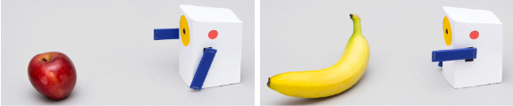

# **Mini-Detecto**

This is a robot AI Individual course project based. I wrote a python script for it to classify between fruits classes like: Orange vs Banana. Using ANN (Artificial Neural Network), CNN (Convloutional Neural Network), and ResNet50 transfer learning. So, based on 10 frames the robot takes, it can decide which is which and point to the correct decision.

You can find:
1. Notebook including all models and success rate comparison.
2. Two fruits testing videos.
3. Servo arduino code.
4. Ros1 publisher node.

In fruits folder here: [Fruits Foler](https://drive.google.com/drive/folders/1w-EiEk41VNLbixKq9Yvn83Vhl8y8OTyG?usp=drive_link)
you can find:

1. The training and testing datasets of Banana and Orange which can you can generate by running the first cell in the Notebook.
2. The .h5 whole model architecture of ANN.
3. The .h5 whole model architecture of CNN.
4. The .h5 whole model architecture of ResNet50 transfer learning.
5. Live webcam evaluating data.

-----------------

# **Running the Code**

After building your ROS1 workspace and uploading the arduino code to your arduino, run the following commands each in separate terminal:
```
roscore
```

```
rosrun miniproject_package miniproject.py
```

```
rosrun rosserial_python serial_node.py /dev/ttyACM0
```

the /dev/ttyACM0 should be the default running port, if not responding try:

```
rosrun rosserial_python serial_node.py /dev/ttyACM1
```

```
rostopic echo /banana_orange_topic
```
